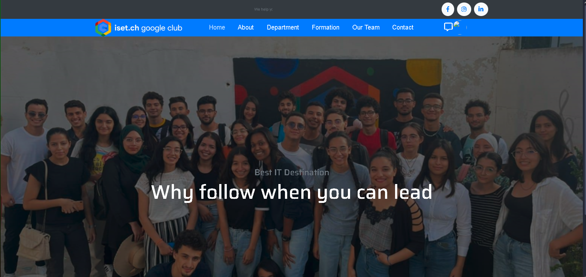
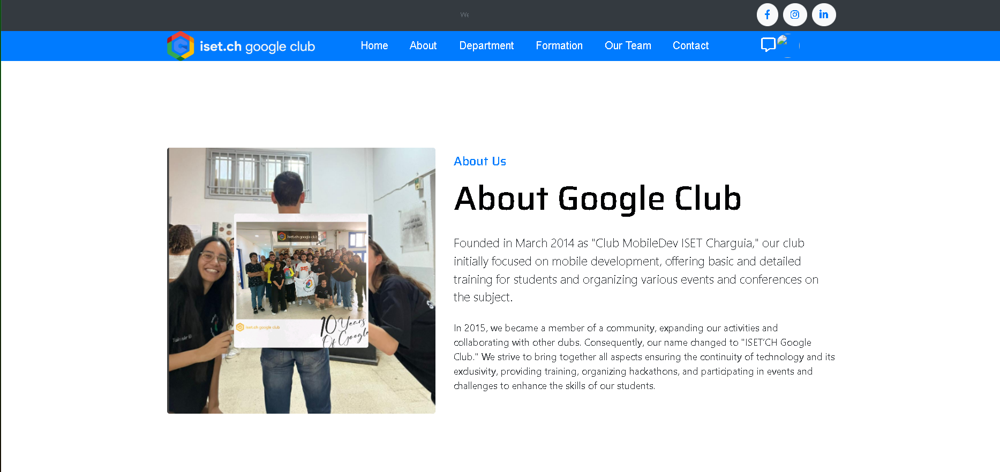
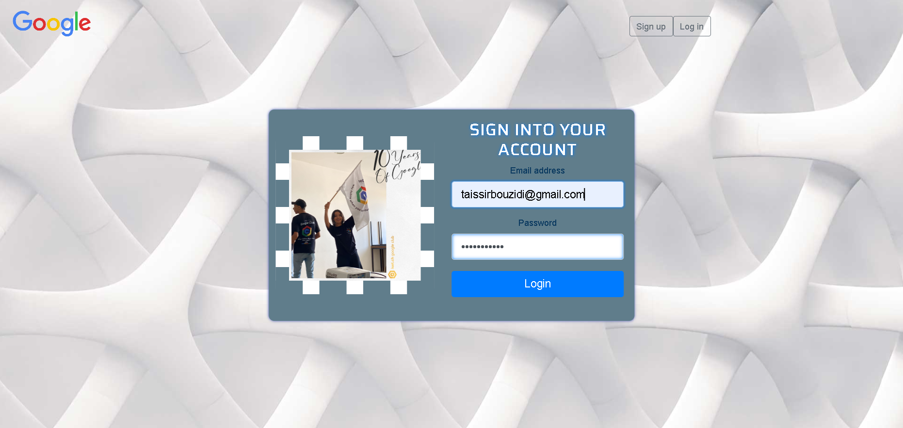
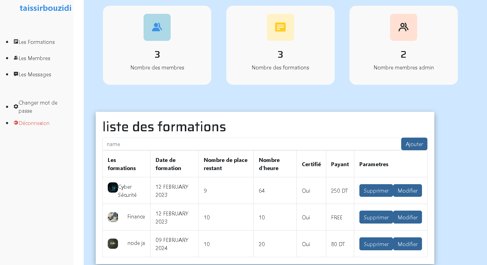

# Google Club Project - Angular Application  

A collaborative project created in **November 2023** as part of the **Google Club activities** at our university. The project demonstrates the use of various Angular concepts and practices learned during our sessions, such as **Two-way Data Binding**, **Event Binding**, **Routing**, **Guards**, **Pipes**, and more.

---

## 🚀 **Getting Started**  

Follow these steps to run the project on your local machine.

### 1. **Clone the Repository**  

```bash  
git clone [<repository_link> ](https://github.com/taysir17/mini-projet.git) 
cd <GoogleClubSite>
```  

### 2. **Install Dependencies**  

Run the following command to install the necessary dependencies:  

```bash  
npm install  
```  

### 3. **Set up the JSON Server**  

The project uses a JSON file to simulate a backend. To start the JSON server:  

```bash  
cd json  
json-server --watch bdform.json  
```  

This will start the server at [http://localhost:3000](http://localhost:3000).  

### 4. **Start the Angular Application**  

In the main project directory, start the Angular development server:  

```bash  
ng serve  
```  

The application will run at [http://localhost:4200](http://localhost:4200).  

---

## ⚙️ **Features**  

This project incorporates various Angular features, including:  

- **Two-way Data Binding**  
- **Event Binding**  
- **Property Binding**  
- **String Interpolation**  
- **Routing**  
- **Guards** for route protection  
- **Pipes** for transforming data  
- **Reactive Forms** with validators  
- **Server HTTP** communication  

---

## 📸 **Screenshots**  

Here are some screenshots of the project:  

### Homepage  
  

### AboutUs  
  

### Login Form  
  

### Admin Dashboard  
  

---

## 🛠 **Technologies Used**  

- **Angular**: Framework for building dynamic, single-page web applications.  
- **JSON Server**: Mock server to simulate backend API.  

---

## 📜 **License**  

This project is licensed under the MIT License. Check the [LICENSE.md](LICENSE.md) file for details.  

---

## 💬 **Contributing**  

Contributions are welcome! Fork the repository, make your changes, and submit a pull request.  

---

## 🧑‍💻 **Contact**  

For any questions, feel free to reach out!  

- Email: [taysirbouzidi123@gmail.com](mailto:taysirbouzidi123@gmail.com)  
